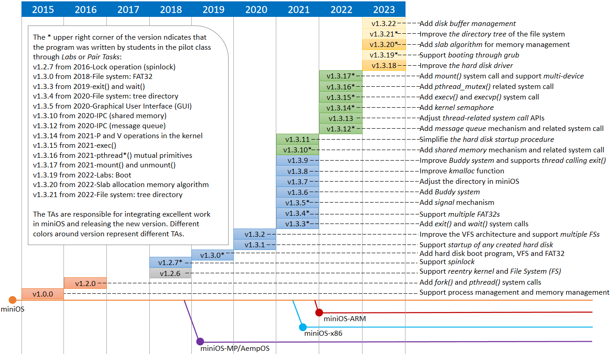

# miniOS introduction
---
miniOS is a miniature operating system kernel for operating system development learners that can run on 32-bit x86 architecture CPUs. miniOS focuses on the learning and research of core concepts and basic principles in operating system development, and implements each basic subsystem or module in the operating system based on general hardware.

The popular [Linux](https://github.com/torvalds/linux), [FreeBSD](https://github.com/freebsd/freebsd) and other operating system kernels are good, but they are not suitable for the kernel Development for beginners. On the one hand, these operating system kernels have been developed for many years and have accumulated a very large amount of code (the early version of the Linux kernel v2.6.12, released in 2005, already had about 4 million lines of code). On the other hand, because of the application For the needs of the production environment, these kernel codes contain a lot of details that have nothing to do with the basic principles of the operating system, and it is difficult for beginners to grasp the essentials. Therefore, start with a simple operating system kernel with a small amount of code, use a short period of time to familiarize yourself with and master the core concepts and basic principles of the operating system kernel development field, and wait until you have mastered these basic knowledge to a certain level before you devote yourself to it. The development of practical kernels such as Linux is a more realistic and feasible strategy for kernel beginners. Even if you don't plan to engage in kernel development, learning some basic knowledge about the operating system through an easy-to-start kernel will help you write more robust and better-performing applications.

**Notice**: The version we open source here is **miniOS-v1.3.2** introduced in the paper "Operating System Teaching Reform: Eight Years of Practical Experience in Running a miniOS Pilot Class". The updated version cannot be open source for the time being, because many of the source programs in it should not be referenced by students in the pilot class (Labs and Pair Tasks we require some students to do have been implemented in these new versions).



# miniOS development tools
---
miniOS is mainly developed based on C language and x86 assembly language. The development tools used include:

* Assembler [nasm](https://www.nasm.us/)
* C language compiler gcc
* GNU Binary Toolset [Binutils](http://www.gnu.org/software/binutils/)
* Project build tool make
* Debugger gdb

Among them, Binutils is a set of tools for operating binary files, including the tool ar to create static libraries, the tool strip to remove symbol tables from binary files to reduce file size, etc.

# Run miniOS
---
miniOS currently boots from a floppy disk, and the startup process is:
1. After the BIOS self-test is completed, it loads the boot program (boot.bin) from the floppy disk boot sector into the memory and hands control to the boot program.
2. The boot program reads the loader (loader.bin) from the floppy disk into memory and hands the controller to the loader.
3. When the loader is running, it will read the miniOS kernel (kernel.bin) from the floppy disk to the memory, then enter the protected mode from the real mode of the CPU, and transfer control to the kernel.
4. miniOS starts running.

Since miniOS is an operating system kernel for learners, it is currently mainly run in a virtual machine. Optional virtual machines include [Bochs](http://bochs.sourceforge.net/) and [Qemu](https://www.qemu.org/).

**Running miniOS in Bochs**
1. Install Bochs. Under the Ubuntu system, you can directly execute the command `sudo apt-get install bochs` to install. You can also download the source code of Bochs first and then compile and install it. You can select the desired Bochs version through the source code installation.
2. Enter the miniOS source directory and execute `tar zxvf misc/80m.img.tar.gz .` to extract the hard disk image from the hard disk image compression package.
3. Execute the `bochs` command in the current directory to start the Bochs virtual machine. Bochs will first read the configuration information from the bochsrc file, and then confirm the running prompt information given by Bochs to allow miniOS to run in Bochs.

**Running miniOS in Qemu**
1. According to Qemu, under the Ubuntu system, you can directly execute the command `sudo apt-get install qemu-system-x86` to follow, or you can download the source code of Qemu for compilation and installation.
2. Enter the miniOS source directory and execute `tar zxvf misc/80m.img.tar.gz .` to extract the hard disk image from the hard disk image compression package.
3. Execute the `./launch-qemu.sh` command in the current directory to start the Qemu virtual machine. After that, miniOS will start running directly in Qemu. The Qemu virtual machine does not use a configuration file like bochsrc. The configuration information is specified through command line options. The script launch-qemu.sh contains the currently used configuration options.

#Debug miniOS
MiniOS can be debugged at the assembly language level by using the built-in debugging function in Bochs or Qemu. However, because the assembler is lengthy and difficult to read, this debugging method is inconvenient to use. Fortunately, both Bochs and Qemu have built-in gdb support. By cooperating with the remote debugging function provided by gdb, miniOS can be debugged at the C source code level.

**Use Bochs+gdb to debug miniOS**
1. Compile and install Bochs from source code, and turn on the gdb support option when compiling. Then add gdb configuration information to the Bochs configuration file. The bochsrc-gdb file in the miniOS source directory already contains the required configuration options.
2. Execute `./launch-bochs-gdb.sh` in the miniOS source directory. The shell script will run gdb in a new terminal window and load the debug version of the kernel binary file.
3. Execute the command `target remote:2345` in the gdb command interface to establish a connection with Bochs.
4. Use gdb to debug miniOS like a local program.

**Use Qemu+gdb to debug miniOS**
1. Add command line options to enable gdb support when starting Qemu. The required configuration options have been added to the script file launch-qemu-gdb.sh in the miniOS source directory.
2. Execute `./launch-bochs-gdb.sh` in the miniOS source directory. The shell script will run gdb in a new terminal window and load the debug version of the kernel binary file.
3. Execute the command `target remote:1234` in the gdb command interface to establish a connection with Qemu.
4. Use gdb to debug miniOS like a local program.

# Common miniOS build options
```
# Compile the miniOS kernel and user program init, and write them to the floppy disk image a.img
make image
# Clear all .o target files
make clean
# Clear all .o object files and executable files
make realclean
```

# References
* [OrangeS](https://github.com/yyu/Oranges), a micro-operating system developed by Yuan Yuan, the development process of OrangeS is described in the book "Implementation of an Operating System". miniOS is developed based on OrangeS.
* [Xv6](https://pdos.csail.mit.edu/6.828/2014/xv6.html), a micro operating system developed by MIT for teaching. Xv6 is adapted from Unix V6 and is used in In MIT's operating system course 6.828: Operating System Engineering.
* [Minix](http://www.minix3.org/), a microkernel operating system originally developed by Professor Andrew S. Tanenbaum. Linus inherited many features from Minix when developing early Linux, Yu Yuan I also borrowed Minix many times when developing Orange's.